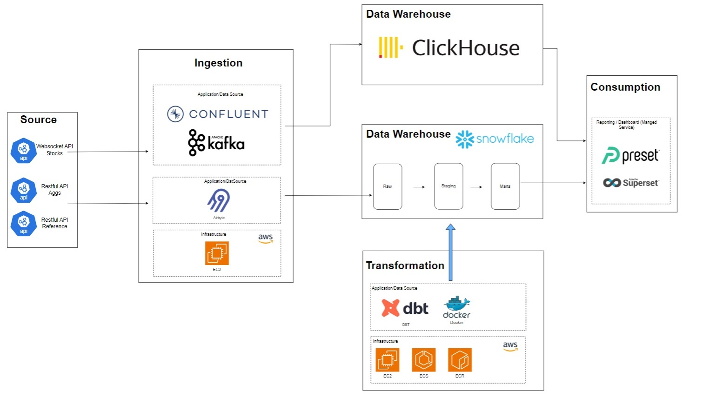

# Polygon Stock API ETL Project
**Objective**

**Business Case**
The proposed project will built an in-house ELT pipeline solution that allows companies to track financial stock analysis

# Solution Architecture

The overall solution is to provide a real-time dashboard for live data while maintain a separate warehouse for more in-depth stock market analysis.

# Project Structre
**1. Integration-elt**

**2. Orchestration**

**3. Transformation**

**4. Visualization**

